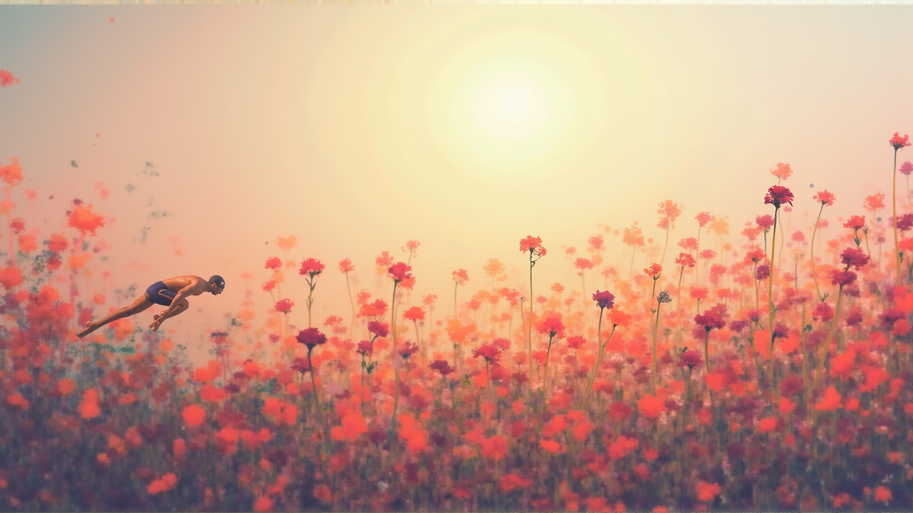
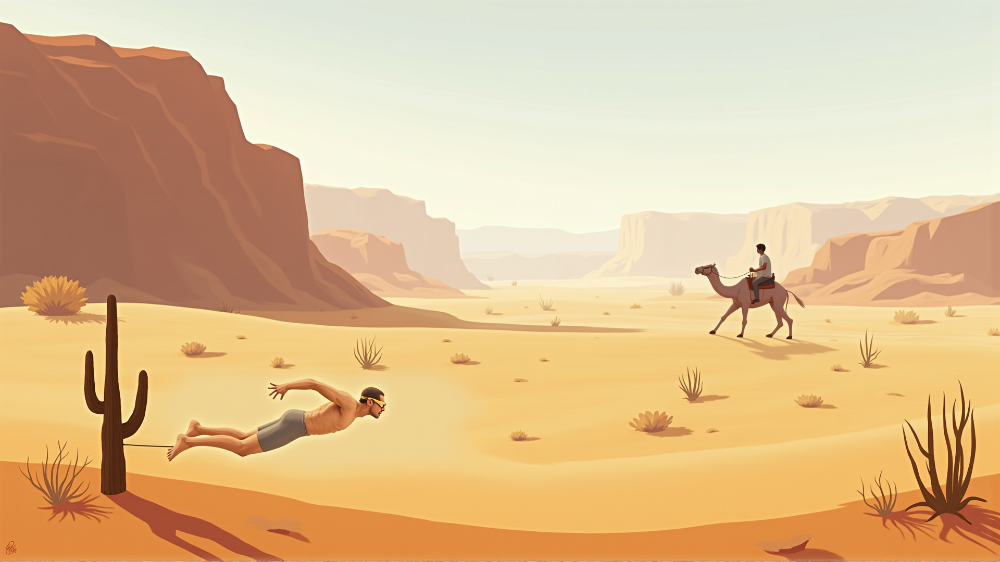
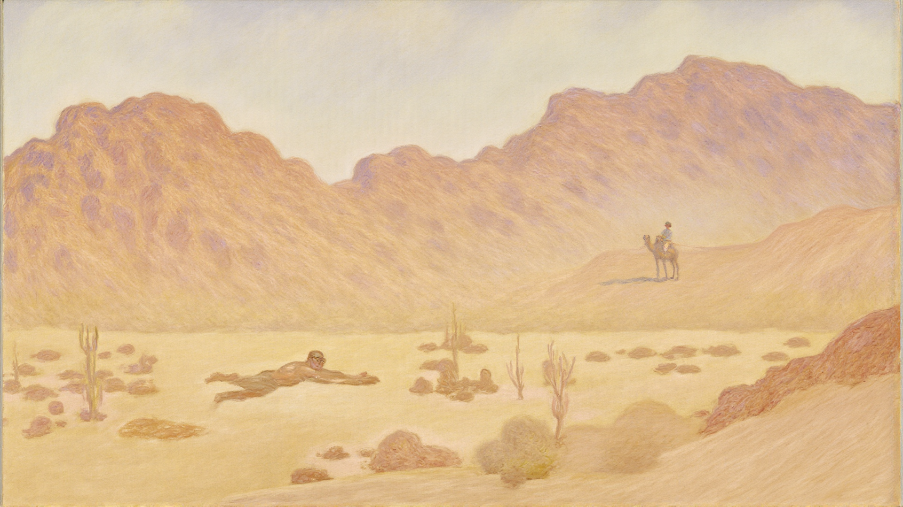
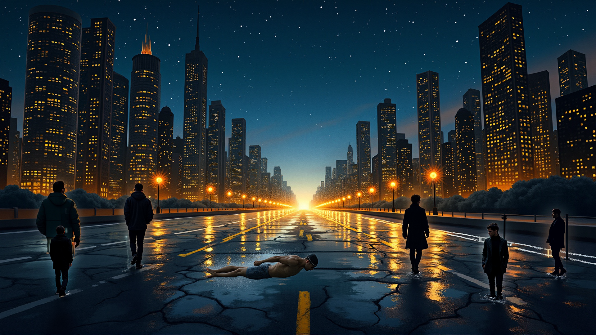
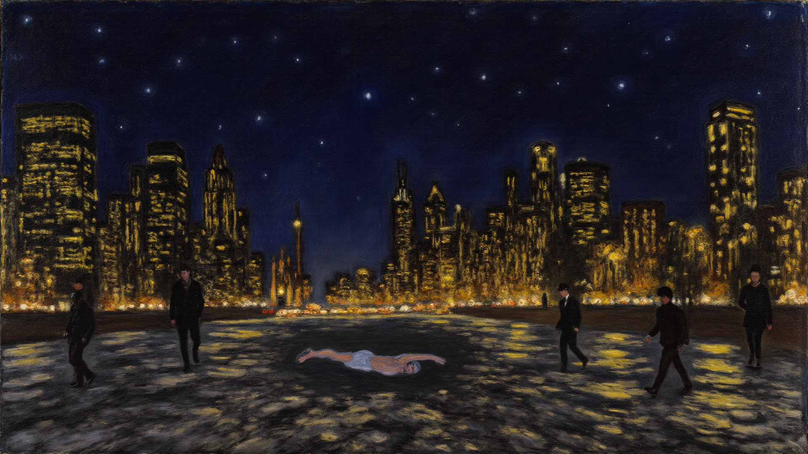
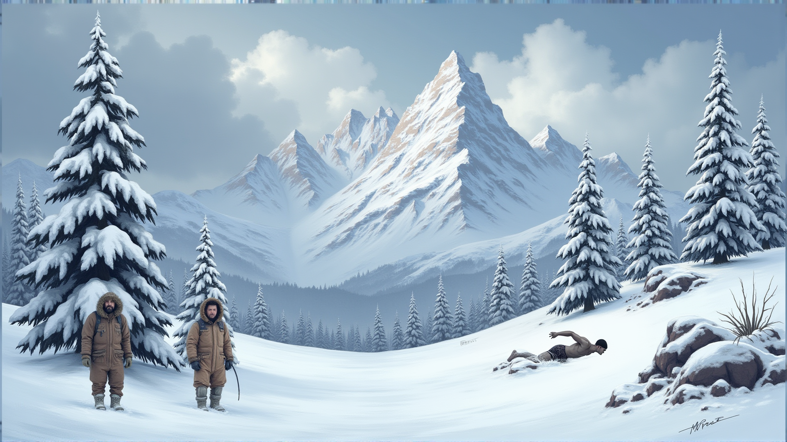
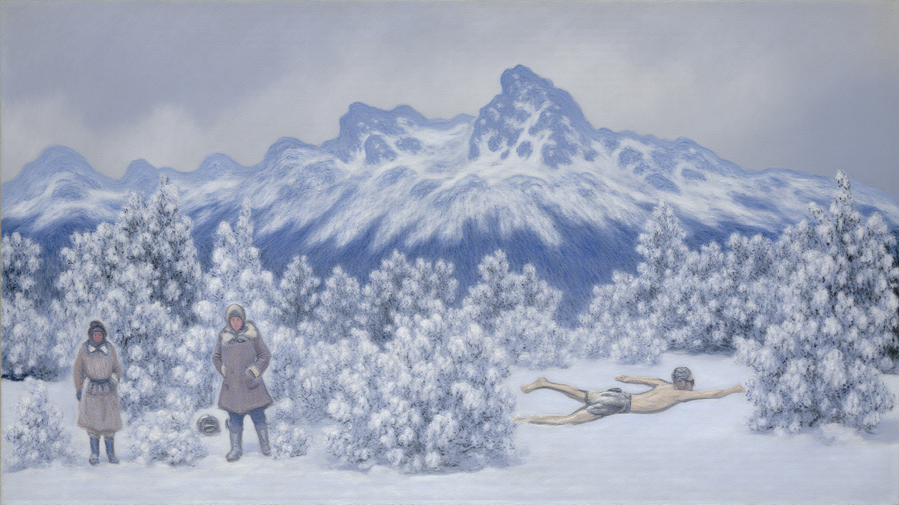
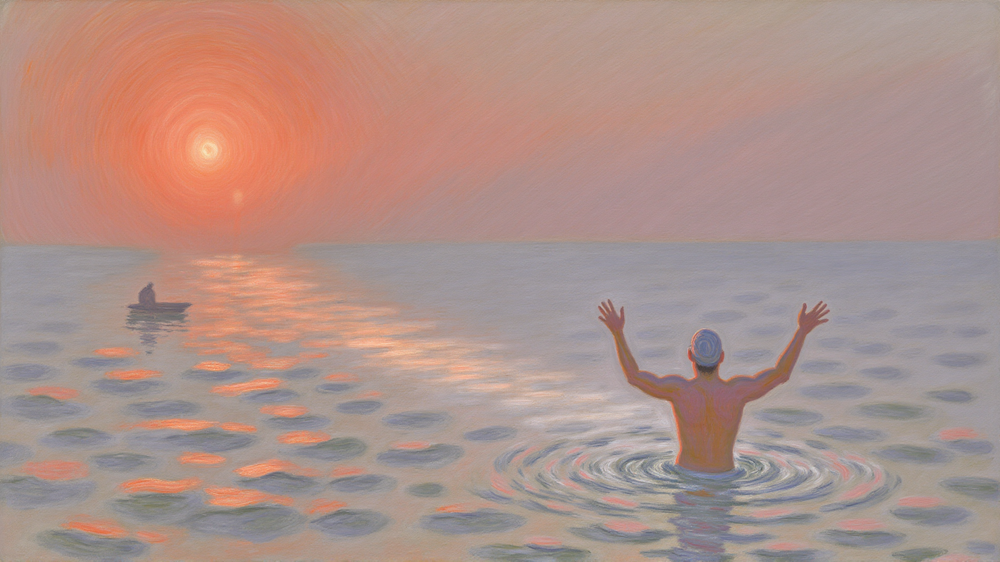

# 2025 AIM Challenge: Creative Art Generation Service utilizing LoRA & Diffusion Models

> **Grand Prize (대상, 교육부장관상) 수상작**
>
> **Project Title**: 물이 없는 곳에서 (Where There Is No Water)

---

## 1. Project Overview

본 프로젝트는 **LoRA(Low-Rank Adaptation)**와 **Diffusion Model**을 활용하여 예술적 창의성과 정량적 지표를 동시에 충족하는 AI 아트워크를 만들어 전시 및 공유한 프로젝트입니다.

"물이 없는 곳에서 수영하려는 몸짓"이라는 초현실적인 주제를 통해, 고난 속에서도 길을 찾는 인간의 여정을 시각화했습니다. 클로드 모네(Claude Monet)의 수련 연작에서 영감을 받아 모네의 그림들을 전처리하여 LoRA 학습에 활용했습니다.

---

## 2. Technical Stack

| Category        | Technology             | Description                           |
| :-------------- | :--------------------- | :------------------------------------ |
| **Base Model**  | Flux.1-dev (12B)       | Transformer 기반 고품질 이미지 생성   |
| **Fine-tuning** | LoRA + kohya_ss        | 모네 화풍 학습을 위한 경량화 파인튜닝 |
| **Inference**   | ComfyUI                | 노드 기반 정밀 워크플로우 제어        |
| **Prompting**   | CLIP + T5 Dual Encoder | 키워드 + 자연어 문맥의 듀얼 인코딩    |
| **Custom Node** | MultiAreaConditioning  | 영역별 프롬프팅을 위한 오픈소스 노드 활용 |
| **Evaluation**  | CLIP, BLIP-2, LPIPS    | 자동화된 정량 평가 파이프라인         |

> [`custom_nodes`](./custom_nodes)에 위치한 커스텀 노드는 [ComfyUI_Dave_CustomNode](https://github.com/Davemane42/ComfyUI_Dave_CustomNode)를 기반으로 하며, 본 프로젝트에서 사용된 ComfyUI 버전에 맞춰 수정되었습니다.

---

## 3. Key Technical Implementations

### A. LoRA Model Training

예술적 화풍과 질감을 Flux 모델에 이식하기 위해 직접 LoRA를 학습했습니다.

**Dataset Preparation**

- 고해상도 예술 이미지 **190장** 수집 (모네의 그림)
- 서명/워터마크 크롭 처리
- **JoyCaption**으로 8~12줄 상세 캡션 자동 생성
    - [`scripts/joycaption_batch.py`](./scripts/joycaption_batch.py): JoyCaption을 사용하여 이미지를 일괄 캡셔닝하는 데 사용됩니다.

**Training Configuration**

SD1.5부터 Flux까지, 캡셔닝 방식(BLIP → DeepBooru → LLaVA → JoyCaption), Learning Rate, Rank/Dim 값 등을 조정하며 **총 22회의 실험**을 진행했습니다. AdamW 8bit와 Gradient Checkpointing을 적용하여 제한된 GPU 자원(RTX A6000) 내에서 학습 효율을 극대화했습니다.

> 실험 결과 및 상세 학습 설정 파일들은 [`configs`](./configs) 디렉토리에서 확인하실 수 있습니다.

```
Structure:    Rank 16 / Alpha 16
Optimizer:    AdamW 8bit
Scheduler:    Cosine with Restarts (3 cycles)
Precision:    bf16 + fp8 base
Steps:        2,850
Batch Size:   4
```

#### LoRA 적용 전/후 비교

|               Before (Base Flux.1-dev)                |                    After (+ LoRA)                     |
| :---------------------------------------------------: | :---------------------------------------------------: |
|  |  |
|  |  |
|  |  |
|  |  |
|  |  |

---

### B. Region-Specific Prompting Workflow

단순 텍스트 프롬프트를 넘어, 화면 내 요소의 물리적 배치를 정밀하게 제어하는 워크플로우를 설계했습니다.

오픈소스 `ComfyUI_Dave_CustomNode`의 `MultiAreaConditioning` 노드를 활용하여, 좌표 기반의 영역 분할 로직으로 배경, 인물, 동작을 독립적으로 제어(X, Y, W, H)할 수 있는 워크플로우를 구축했습니다.

**영역별 제어 예시**

- 전체 배경: 산, 설원, 하늘 (weight: 1.0)
- 인물 1: 수영 동작 (weight: 1.2)
- 인물 2: 서 있는 자세 (weight: 0.8)


---

### C. Automated Evaluation Pipeline

대회에서 제시한 정량 평가 기준(CLIP, BLIP-2, LPIPS)을 충족하기 위해, Python 기반의 자동 평가 파이프라인을 구축했습니다. 생성된 이미지들의 점수를 자동으로 산출하여 CSV/JSON 형식으로 출력하고, 이를 기반으로 최종 결과물을 선별했습니다.
> 파이프라인 코드: [`scripts/evaluation.py`](./scripts/evaluation.py)
>
> 정량적 평가 파이프라인을 위해 사용됩니다.

| Metric                | Role                        | Target |
| :-------------------- | :-------------------------- | :----: |
| **CLIP Score**        | 텍스트-이미지 일치도        | ≥ 0.4  |
| **BLIP-2 Similarity** | 의미론적 완성도             | ≥ 0.4  |
| **LPIPS**             | 지각적 품질 (낮을수록 좋음) | ≤ 0.6  |

**Scoring Formula**

```python
Total = (CLIP_norm × 0.2) + (LPIPS_norm × 0.3) + (BLIP2_norm × 0.5)
```

---

## 4. Evaluation & Results

본 대회는 정량적 수치와 정성적 창의성을 결합하여 평가되었습니다.

| 평가 항목     | 비중 | 결과                                          |
| :------------ | :--: | :-------------------------------------------- |
| **정량 평가** | 50%  | CLIP/BLIP-2 ≥ 0.4, LPIPS ≤ 0.6 만점 기준 근접 |
| **정성 평가** | 30%  | 주제 독창성, 발표력 우수 평가              |
| **관객 투표** | 20%  | 전시 현장 실시간 투표에서 높은 지지 획득      |

### Award

**Grand Prize (대상) - 교육부장관상 수상**

---

## 5. Final Artworks

제출된 최종 5개 이미지는 설원, 사막, 도시 등 물이 없는 다양한 공간에서 꿈을 향해 나아가는 모습을 담고 있습니다.

|                                                       |                                                       |                                                       |
| :---------------------------------------------------: | :---------------------------------------------------: | :---------------------------------------------------: |
|  |  |  |

|                                                       |                                                       |
| :---------------------------------------------------: | :---------------------------------------------------: |
|  |  |

---

## 6. Repository Structure

```
2025AIMChallenge/
├── README.md
├── assets/
│   ├── final/                  # 최종 작품 (LoRA 적용)
│   ├── before/                 # 비교용 (LoRA 미적용)
│   └── workflow_diagram.png
├── configs/                    # LoRA 학습 실험 설정들
├── custom_nodes/               # 수정된 Custom Node
├── workflow/                   # ComfyUI 워크플로우 JSON
└── scripts/
    ├── evaluation.py           # 정량 평가 파이프라인
    └── joycaption_batch.py     # 캡션 생성 스크립트
```

---
